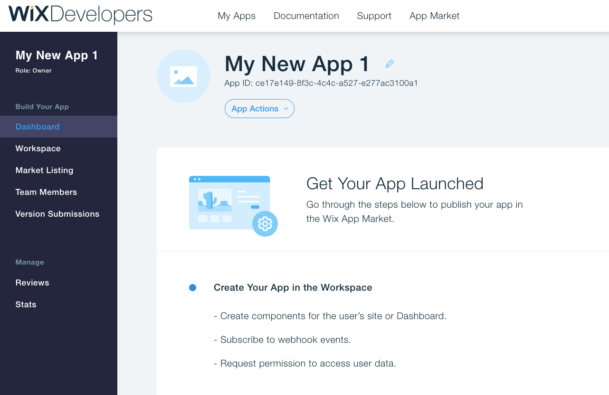
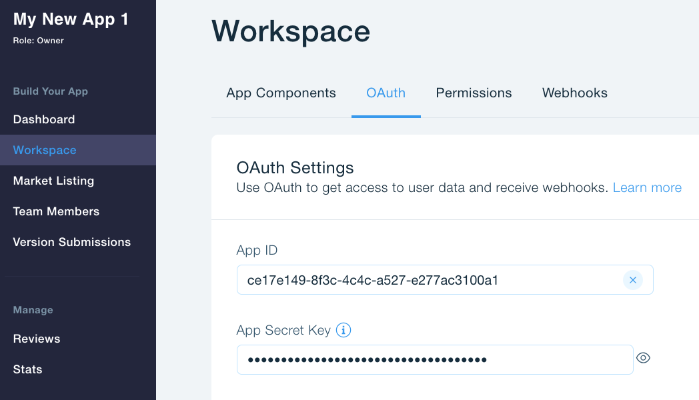
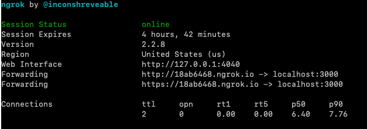
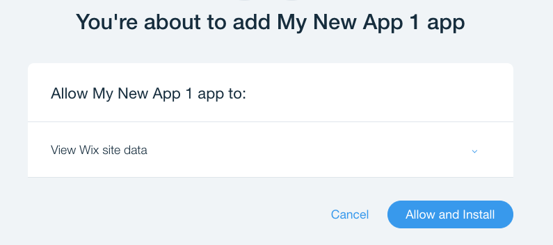

# Tutorial: Create your first Wix Application on your machine
In this tutorial we go over how to create a Wix Application that interacts with the Wix platform that you will can submit to the Wix App Market, where Wix site owners can deploy it on their sites.   
## 1. Set up your app in a Wix Developers account 
A. Go to [Wix Developers](https://dev.wix.com/) and login/signup to Wix Developers.

B. Click 

You should get this screen:

C. Go to Workspace > OAuth and copy your `App ID` and `App Secret Key`. You will need them later.
 

D. Go to Workspace > Webhooks and copy your `Public key`. You will need it later.

## 2. Create and run your app

A. Download and install [npm](https://www.npmjs.com/get-npm)

B. Clone the [Wix Sample Application](https://github.com/shaykewix/sample-wix-rest-app) to your machine

C. In the **config.js file (in the `src` folder)**:  
  - find and replace the APP_ID with the value you copied from Wix Developers:
   
  - find and replace the PUBLIC_KEY with the value you copied from Wix Developers:
  

D. In the **credentials.js file (in the `src` folder)** find and replace the APP_SECRET  with the value you copied from Wix Developers:

E. Run your app

* Browse to the cloned sample application
* Run `npm install`
* Run `npm build`
* Run `npm start`

You should get something like this:

## 3. Set up the application to receive inbound HTTPS connections
Since most developers machine are not open for inbound connection and don't have HTTPS certificates, we will use **ngrok**.
If you are hosting your application on a server without these restrictions, you can skip this step.

A. Install and run [ngrok](https://dashboard.ngrok.com/get-started)

Start an HTTP tunnel on the port your app is listening on  (default is 3000)
You should get something like this:

**Don't close the ngrok process** - You will need it running for the entire process.

B. Set up your application URLs
* Go to Workspace > OAuth
* in **`Redirect URL`** enter: `https://<12345678>.ngrok.io/login`
* in **`App URL`** enter: `https://<12345678>.ngrok.io/signup`  
**Remember to replace '12345678' with ** your ngrok string you got above.**
for example:

Don't forget to click Save.

Well done! Now it's time to make sure your app works as expected.

## 4. Test your app

A. Click `Test Your App`

B. Select a site and click `Test Your App`

C. When prompted, click `Add To Site`:

D. Provide consent for the app to collect data by clicking `Allow and Install`:

E. You should get a print into the browser with your application ID and your site instance ID:

# Congrats, you're done!
## Now you can add your Application logic and Other WIX APIs.
